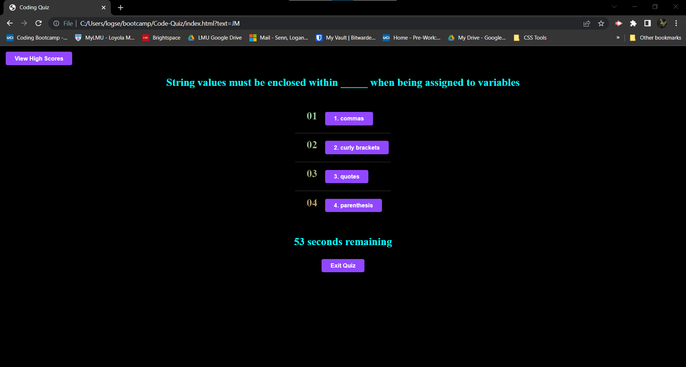
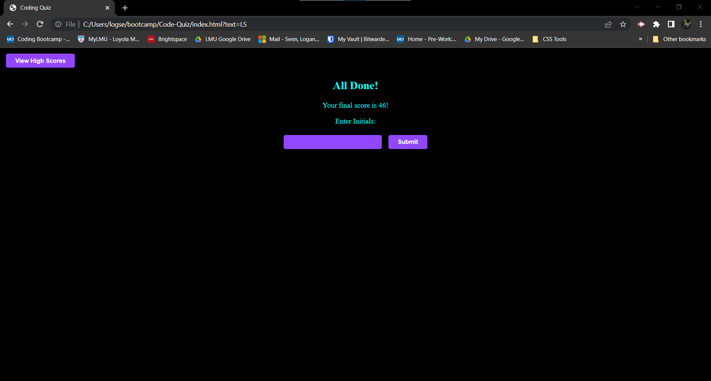
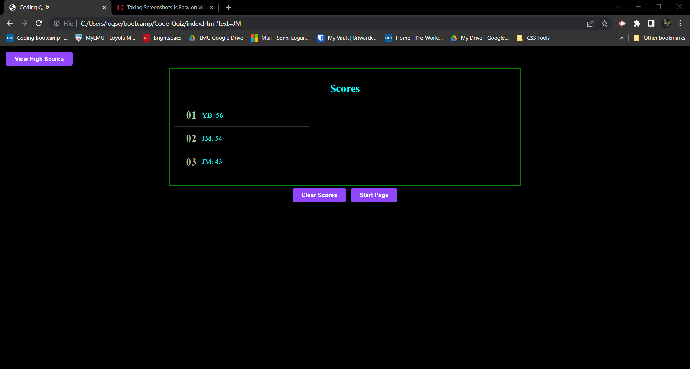
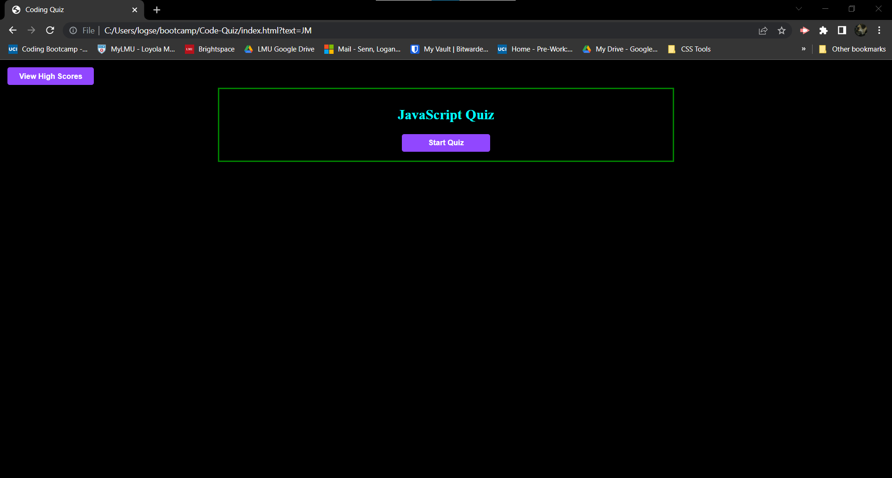

Application will start off on simple home page with two options, start quiz and view high scores

When start quiz button is pressed, a 90 second timer starts, and the user will need to answer 5 questions 

Each incorrect answer will take 10 seconds off of the timer, and once all 5 are answered, or the timer hits 0, the quiz ends

Once the quiz ends, the user will get to enter their initials, and their score will be added to the high score list, which is sorted from highest to lowest

After submitting initials, the user will be returned to the home page

